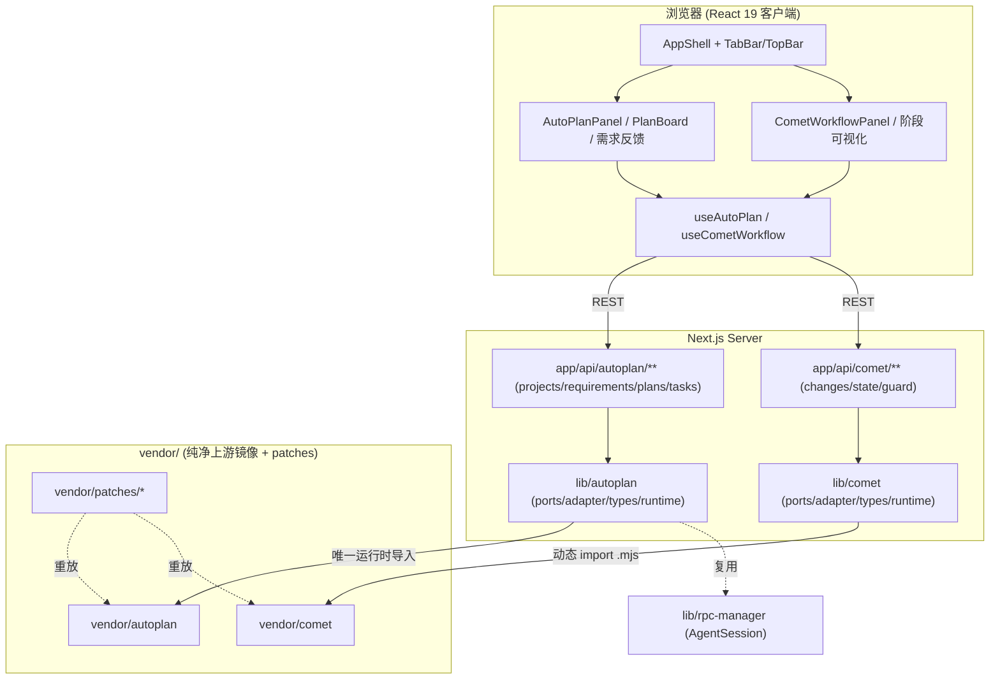

## 用户需求

将 `lyming99/autoplan`（24 小时自主编程工具，核心为自动化计划生成、需求/反馈/任务队列与执行器桥接）与 `rpamis/comet`（可恢复长时间任务工作流 + 编码技能平台，核心为五阶段状态机、OpenSpec 工件与 `.mjs` 守卫脚本）作为核心模块深度融入当前 pi-web（Next.js 16 全栈应用）。

## 产品概述

以「Vendor 拷贝 + 同步脚本」方式把两仓库源码镜像到本地 `vendor/`（纯净上游镜像，不直接改动），通过借鉴现有 `lib/pi` 的反腐层（Anti-Corruption Layer）端口/适配范式，在 `lib/autoplan`、`lib/comet` 建立本地适配与桥接层，并把能力接入 pi-web 的服务端与前端。先完成源码级深度分析，再据结果确定融合重点（默认两者皆做、作为独立子系统并存）。最终交付完整融合代码，并提供可平滑跟进上游迭代的更新机制。

## 核心特性

- 克隆并 vendoring 两仓库到 `vendor/`，记录钉选版本（VENDOR.lock）
- 对两仓库做源码级深度分析，产出架构/类/接口/数据流/依赖梳理文档
- 设计模块拆分、端口接口与桥接策略（复用 `lib/pi` 的 PiSdkPort 范式）
- 在 `lib/autoplan`、`lib/comet` 实现适配层 + 服务端运行时，并新增 `app/api/autoplan/**`、`app/api/comet/**` 路由
- 新增前端面板（计划看板、需求/反馈、工作流阶段可视化）与对应 hooks，接入 AppShell
- 提供 `scripts/sync-vendor.mjs` 更新机制（拉取上游指定 ref、重放本地 patch、校验冲突），并完善 docs 与 AGENTS.md

## 技术栈选择

- 复用现有栈：Next.js 16（App Router）+ React 19 + TypeScript 5（strict）+ Tailwind CSS 4；服务端纯 Node 运行时（`app/api/**`、`lib/*-runtime.ts`）。
- 上游 vendoring：`vendor/autoplan`（TS/JS + Vite 前端形态）、`vendor/comet`（TS + 纯 Node `.mjs` 脚本）。两者均**仅服务端调用**，不进客户端 bundle。
- 适配范式：严格复用 `lib/pi-ports.ts` / `lib/pi-sdk-adapter.ts` / `lib/pi-types.ts` 的「端口契约 + 单一运行时导入点 + 领域类型」三层结构（见 `docs/ARCHITECTURE-DECOUPLING.md`）。

## 实现思路

采用「纯净镜像 + 本地防腐适配层 + 同步脚本」策略：

1. `vendor/<repo>` 是上游在钉选 commit 的**原样拷贝**（禁止直接编辑），所有本地行为改动集中在 `lib/<repo>` 适配层；必须改上游源码的修复以 `.patch` 形式存于 `vendor/patches/<repo>/` 并在同步时重放。
2. 复用 `PiSdkPort` 模式定义 `AutoPlanPort` / `CometPort` 接口（业务层只依赖端口），`*-adapter.ts` 为唯一运行时导入 `vendor/<repo>` 的地方，经 `registerXxxAdapter()` 可替换/打桩。
3. 服务端运行时（`autoplan-runtime.ts` / `comet-runtime.ts`）承载工作循环调度与 comet `.mjs` 脚本调用（动态 `import()` 或 `child_process`），沿用 `lib/rpc-manager.ts` 的空闲超时与全局单例（挂在 `globalThis`）避免重复实例。
4. 更新机制：`scripts/sync-vendor.mjs` 读取 `vendor/VENDOR.lock` 的目标 ref，fetch 上游、checkout、应用 `vendor/patches` 并做冲突/类型校验，输出新版 lock。

## 关键技术决策与权衡

- **为何 vendoring 而非 submodule/subtree**：Web 单体需对上游源码做深度改造（修导入、接 pi 运行时、改调用协议），submodule 改源码需进子模块、subtree 历史膨胀；vendor 拷贝 + patch 重放对「源码级改造 + 平滑跟进」最友好，且 lock 文件让版本可追溯。
- **为何镜像层不直接编辑**：保证 `git diff vendor/` 仅来自上游同步，本地逻辑与上游边界清晰，re-sync 时冲突只发生在 patch 层，blast radius 可控。
- **服务端隔离**：`vendor/comet` 的 `.mjs` 与 `vendor/autoplan` 的执行器依赖 Node 运行时/子进程；在 `next.config.ts` 的 `serverExternalPackages` 追加相关入口，并对运行时文件加 `import "server-only"`，杜绝客户端打包。

## 实现要点（防回归）

- **性能/资源**：autoplan 工作循环与 comet 工作流均为长任务，应复用 `rpc-manager` 的空闲销毁（当前 10 分钟）与 `globalThis` 锁合并并发，避免泄漏；事件流/计划读写走增量而非整树重扫，沿用 `session-reader.ts` 的路径缓存（60s TTL）思路。
- **日志**：复用项目既有日志约定，记录同步 ref、patch 应用结果、冲突文件；不打印上游大 payload，错误信息带 repo/commit 便于定位。
- **向后兼容**：不改动 `lib/pi`、现有 API 与 AppShell 既有布局；新增 API 域独立，前端面板作为新 Tab/面板挂载，默认关闭或按需启用（feature flag 可选）。
- **i18n**：面板中文案走 `lib/i18n/zh.ts`（新增 `autoplan.*` / `comet.*` 键），中文模式禁止裸英文状态提示。

## 架构设计



（既有 `app/api/agent`、`lib/pi` 链路保持不变，仅新增并行域。）

## 目录结构

```
vendor/
├── VENDOR.lock                  # [NEW] 记录 autoplan/comet 钉选 commit、license、patch 列表与同步元数据
├── autoplan/                    # [NEW] 上游原样镜像（禁止直接编辑，改动经 patches）
├── comet/                       # [NEW] 上游原样镜像（含 .mjs 脚本与状态机）
└── patches/                     # [NEW] 本地补丁集，同步时重放
    ├── autoplan/0001-*.patch
    └── comet/0001-*.patch
scripts/
└── sync-vendor.mjs              # [NEW] 读取 VENDOR.lock → fetch/checkout 上游 → 应用 patches → 冲突/类型校验
lib/
├── autoplan/
│   ├── autoplan-ports.ts        # [NEW] AutoPlanPort 端口契约（业务层唯一依赖面）
│   ├── autoplan-adapter.ts      # [NEW] 唯一运行时导入 vendor/autoplan 的适配实现 + registerAutoPlanAdapter()
│   ├── autoplan-types.ts        # [NEW] 领域类型：Project/Requirement/Feedback/Plan/Task（可回溯）
│   └── autoplan-runtime.ts      # [NEW] 工作循环调度 + 执行器桥接（server-only，globalThis 单例）
├── comet/
│   ├── comet-ports.ts           # [NEW] CometPort 端口契约
│   ├── comet-adapter.ts         # [NEW] 桥接 vendor/comet .mjs 脚本与状态机 + registerCometAdapter()
│   ├── comet-types.ts           # [NEW] 领域类型：Change/Stage/StateEvent/RunState
│   └── comet-runtime.ts         # [NEW] 五阶段工作流编排 + 可恢复 run_id 管理（server-only）
app/api/
├── autoplan/                    # [NEW] projects / requirements / plans / tasks 路由（按业务域拆分）
└── comet/                       # [NEW] changes / state / guard 路由
components/
├── AutoPlanPanel.tsx            # [NEW] 项目管理 + 需求/反馈 + 计划看板容器
├── PlanBoard.tsx                # [NEW] 任务队列看板（可回溯/长期记忆可视化）
├── RequirementFeedbackPanel.tsx # [NEW] 需求录入与反馈闭环
├── CometWorkflowPanel.tsx       # [NEW] 工作流阶段可视化容器
└── WorkflowStageIndicator.tsx   # [NEW] 五阶段状态机指示器（open→design→build→verify→archive + 守卫态）
hooks/
├── useAutoPlan.ts               # [NEW] 计划/需求/任务数据获取与操作
└── useCometWorkflow.ts          # [NEW] 工作流状态订阅与阶段切换
docs/
├── vendor-autoplan.md           # [NEW] autoplan 源码级分析：架构/类/接口/数据流/依赖
├── vendor-comet.md              # [NEW] comet 源码级分析：状态机/.mjs/技能 harness/恢复机制
└── VENDOR-INTEGRATION.md        # [NEW] 解耦与融合方案 + 更新机制说明
AGENTS.md                        # [MODIFY] 增补 vendor 集成约定、同步流程与目录说明
next.config.ts                   # [MODIFY] serverExternalPackages 追加 vendor 运行时入口（如需）
lib/i18n/zh.ts                   # [MODIFY] 新增 autoplan.* / comet.* 中文文案键
```

## 关键代码结构

端口层严格复用 `lib/pi-ports.ts` 的「命名访问器 + 单一适配实现 + registerXxxAdapter()」形态（具体字段待源码分析后据 autoplan/comet 真实导出补全，避免臆造签名），例如：

```
export interface AutoPlanPort {
  readonly ProjectManager: typeof VendorProjectManager; // 命名导出，类型直通上游
  readonly Planner: typeof VendorPlanner;
  readonly Executor: typeof VendorExecutor;
  readonly agentDir: string;
}
// adapter 实现 registerAutoPlanAdapter(defaultAdapter)，业务层仅依赖端口
```

## 设计风格

沿用 pi-web 既有「明/暗双主题 + CSS 变量 + Tailwind」体系，保持与 AppShell / TopBar / TabBar 一致的桌面端布局，不引入独立导航。新增面板作为 AppShell 内的 Tab/侧栏面板挂载，风格采用深色科技仪表盘（Glassmorphism 玻璃拟态卡片 + 柔和渐变 + 微交互动效），确保与现有界面视觉连续。

## 页面/面板规划（不超过 6 屏，作为 AppShell 内嵌面板）

### 面板一：AutoPlanPanel（计划与需求工作台）

- 块1 顶部条：项目切换下拉 + 工作循环启停开关 + 事件流折叠按钮（复用 TopBarButton 风格）
- 块2 左栏：项目树 / 需求列表（新增需求输入框，支持经 MCP 接入的需求）
- 块3 中栏：PlanBoard 计划看板——任务卡片按状态分列，卡片可展开查看回溯链与长期记忆
- 块4 右栏：RequirementFeedbackPanel 反馈闭环与事件流日志（实时追加、可定位）

### 面板二：CometWorkflowPanel（工作流阶段可视化）

- 块1 顶部条：变更(Change)选择 + run_id 恢复指示器（跨设备恢复态）
- 块2 五阶段 Stepper：open→design→build→verify→archive，当前阶段高亮、阶段守卫态以锁定图标提示
- 块3 阶段详情：当前阶段产物（proposal/design/specs/tasks）预览，验证证据强制态提示
- 块4 动作区：阶段推进/归档按钮（受 guard 约束），底部显示状态转换审计日志入口

## Agent Extensions

### SubAgent

- **code-explorer**
- 用途：克隆完成后，对 `vendor/autoplan` 与 `vendor/comet` 做跨多文件、跨目录的源码级深度分析（架构、关键类/接口、数据流、依赖关系），产出结构化事实供后续设计使用。
- 预期结果：输出两仓库核心模块清单、关键类型/函数签名、调用关系与依赖边界，作为 `docs/vendor-autoplan.md`、`docs/vendor-comet.md` 的事实来源。

### Skill

- **codebase-design**
- 用途：基于分析结果，设计 `lib/autoplan`、`lib/comet` 的端口/适配接口与模块拆分（接缝位置、共享词汇、可测试性），复用 `lib/pi` 的反腐层范式。
- 预期结果：产出可落地的 `AutoPlanPort` / `CometPort` 接口契约与目录接缝方案，确保业务层只依赖端口、适配层为唯一上游导入点。