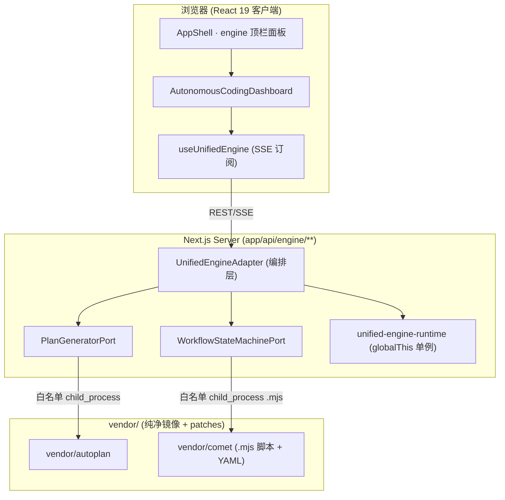

## 用户需求

将 autoplan 与 comet 作为核心模块融合进 pi-web，先完成两仓库源码级深度分析，再输出解耦与融合方案并落地完整集成，同时设计可平滑跟进上游的更新机制。

## 产品概述

以「Vendor 纯净镜像 + 同步脚本」为基座，把 autoplan 的自动化计划生成/任务队列/执行器桥接能力与 comet 的五阶段可恢复状态机/OpenSpec 工件/守卫脚本融合为一套统一的「自主长时开发工作流引擎」。comet 负责生命周期纪律与断点续跑，autoplan 负责需求拆解、任务执行与反馈迭代；对外暴露单一引擎门户，内部保留两个上游的可替换边界。

## 核心特性

- 克隆并 vendoring 两仓库到 `vendor/`（纯净镜像，不直接编辑），记录钉选版本（VENDOR.lock）与本地补丁集。
- 对两仓库做源码级深度分析，产出架构/类/接口/数据流/依赖梳理文档（重点锁定 comet 真实 `.mjs` CLI 入口与 YAML 状态格式、autoplan planner/executor/event-loop 真实模块）。
- 设计分层端口：业务门面 `UnifiedEnginePort` + 两个能力端口 `PlanGeneratorPort`(autoplan) / `WorkflowStateMachinePort`(comet) + 双适配层与编排层，复用 `lib/pi` 反腐层范式。
- 以 comet 五阶段状态机为骨架，Build 阶段由引擎调用 autoplan 拆任务并驱动执行，完成后触发 comet 守卫校验（`.mjs` CLI），通过则流转、失败则把守卫错误作为 feedback 回灌 autoplan 重规划。
- 新增统一前端面板 `AutonomousCodingDashboard`（需求树 + 五阶段 Stepper + 任务看板 + 事件/反馈流），接入 AppShell 的 engine 顶栏面板，文案走 i18n 中文键。
- 安全：视 vendor 为不可信供应链，对上游 `.mjs` 仅白名单 `child_process` 调用 + 参数校验 + feature flag 门禁，autoplan 执行器默认关闭。
- 更新机制：`scripts/sync-vendor.mjs` 支持 compat/fusion 分层补丁、双仓版本校验、类型检查、冲突检测与前端/CLI 代码裁剪。

## 技术栈选择

- 复用现有栈：Next.js 16（App Router）+ React 19 + TypeScript 5（strict）+ Tailwind CSS 4；服务端纯 Node 运行时（`app/api/**`、`lib/unified-engine/**`）。
- 上游 vendoring：`vendor/autoplan`、`vendor/comet` 为原样镜像，仅服务端调用，不进客户端 bundle（追加 `next.config.ts` 的 `serverExternalPackages`）。
- 适配范式：严格复用已核实的 `lib/pi-ports.ts`（`PiSdkPort`：readonly 命名访问器借 `typeof` 直传类型）+ `lib/pi-sdk-adapter.ts`（唯一运行时导入点 `SdkAdapter`）+ `lib/pi.ts`（`registerPiAdapter`/`getPiAdapter`）三层结构。

## 实现思路

采用「纯净镜像 + 分层反腐端口 + 白名单 CLI 桥接 + 同步脚本」策略：

1. `vendor/<repo>` 是上游在钉选 commit 的原样拷贝（禁止直接编辑）；本地行为改动集中在 `lib/unified-engine` 适配层，必须改上游的修复以 `.patch` 形式存于 `vendor/patches/<repo>/` 并在同步时重放。
2. 三层端口：业务层只依赖 `UnifiedEnginePort`（门面）；其下 `PlanGeneratorPort`、`WorkflowStateMachinePort` 两个能力端口分别由 `autoplan-adapter.ts`、`comet-adapter.ts` 实现（各自唯一导入对应 vendor）；`unified-engine-adapter.ts` 组合两端口做融合编排（阶段推进时调计划生成、完成后调守卫校验）。
3. 桥接方式：comet 的 `.mjs` 脚本与 autoplan 的执行器**全部经 `child_process`（白名单脚本路径 + 显式 argv 校验）调用**，绝不 `import()` 未审计上游；执行器默认关闭，由 `ENGINE_AUTOPLAN_EXECUTOR` flag 门禁；调用记录来源 commit 与 argv 以便审计。
4. 运行时：`unified-engine-runtime.ts` 复用 `lib/rpc-manager.ts` 的 `globalThis` 单例 + 10 分钟空闲销毁（避免长任务泄漏），状态落 comet `run-state` 体系实现断点续跑。

## 关键技术决策与权衡

- **为何 vendoring 而非 submodule/subtree**：Web 单体需对上游做源码级深度改造，vendor + patch 重放对「改造 + 平滑跟进」最友好，lock 文件让版本可追溯。
- **为何分层端口而非单端口**：保留两上游独立边界、可替换、可打桩，且避免融合建议中臆造库式 API（comet 实为 prompt+CLI 驱动）。
- **安全优先**：autoplan 执行器会 shell-out 到外部 coding agent，属供应链/运维风险；按不可信供应链处理，白名单 + flag + 审计三重门禁。
- **状态不销毁上游**：autoplan 自管其领域状态，编排层只做镜像/翻译，不把任务状态全搬进 `.comet.yaml`，保各自可恢复性。

## 实现要点（防回归）

- **性能/资源**：长任务单例复用 `globalThis` + 空闲销毁；事件流走 SSE 增量推送，避免整树重扫；`.mjs` 调用设超时与并发上限。
- **日志**：复用项目既有日志约定，记录同步 ref、patch 应用结果、冲突文件；不打印上游大 payload，错误带 repo/commit。
- **向后兼容**：不改 `lib/pi`、现有 API、AppShell 既有面板；新仪表板以 `engine` 顶栏面板挂载（沿用 `activeTopPanel` 联合类型 + `TopBarButton`），blast radius 最小。
- **i18n**：新增 `engine.*` 键须同步写入 `lib/i18n/en.ts`（事实源）与 `zh.ts`，中文模式禁止裸英文。

## 架构设计



## 目录结构

```
vendor/
├── VENDOR.lock                  # [NEW] 记录 autoplan/comet 钉选 commit、license、patch 列表与同步元数据
├── autoplan/                    # [NEW] 上游原样镜像（禁止直接编辑）
├── comet/                       # [NEW] 上游原样镜像（.mjs 脚本 + 状态机）
└── patches/                     # [NEW] 分层补丁：00xx-compat / 01xx-fusion
    ├── autoplan/0001-*.patch
    └── comet/0001-*.patch
scripts/
└── sync-vendor.mjs              # [NEW] 读 VENDOR.lock → fetch/checkout → 应用 patches → 双仓版本校验 + tsc + 冲突检测 + 前端/CLI 裁剪
lib/unified-engine/
├── unified-engine-ports.ts      # [NEW] UnifiedEnginePort 门面契约（业务层唯一依赖）
├── plan-generator-ports.ts      # [NEW] PlanGeneratorPort 能力端口（autoplan 侧语义）
├── workflow-state-machine-ports.ts # [NEW] WorkflowStateMachinePort 能力端口（comet 侧语义）
├── autoplan-adapter.ts          # [NEW] 唯一导入 vendor/autoplan；registerAutoPlanAdapter()
├── comet-adapter.ts             # [NEW] 唯一导入 vendor/comet；registerCometAdapter()
├── unified-engine-adapter.ts    # [NEW] 组合两能力端口做融合编排
├── unified-engine-runtime.ts    # [NEW] 工作循环 + run_id 恢复（server-only, globalThis 单例）
├── guards/run-guard.mjs.ts      # [NEW] 封装 comet .mjs 守卫的 child_process 白名单调用
└── unified-engine-types.ts      # [NEW] 融合领域类型（Change/Run/Stage/Plan/Task/GuardResult）
app/api/engine/                  # [NEW] changes / runs / stages / stream(SSE) 路由
components/
├── AutonomousCodingDashboard.tsx # [NEW] 融合单面板（需求树+Stepper+看板+事件流）
├── StageStepper.tsx             # [NEW] 五阶段状态机指示器（含守卫锁定态）
├── PlanTaskCard.tsx             # [NEW] 任务卡片（状态/回溯链/守卫）
└── RequirementTree.tsx          # [NEW] 需求/变更列表 + 新建入口
hooks/
└── useUnifiedEngine.ts          # [NEW] 引擎状态获取与 SSE 订阅
docs/
├── vendor-autoplan.md           # [NEW] autoplan 源码级分析
├── vendor-comet.md              # [NEW] comet 源码级分析（.mjs + YAML + 状态机）
└── VENDOR-INTEGRATION.md        # [NEW] 解耦/融合/更新机制说明
AGENTS.md                        # [MODIFY] 增补 vendor 集成约定与同步流程
next.config.ts                   # [MODIFY] serverExternalPackages 追加 vendor 运行时入口
lib/i18n/en.ts                   # [MODIFY] 新增 engine.* 键（事实源）
lib/i18n/zh.ts                   # [MODIFY] 同步 engine.* 中文键
components/AppShell.tsx          # [MODIFY] activeTopPanel 联合类型增 "engine" + 顶栏按钮 + 渲染块
```

## 关键代码结构

业务门面（自主定义、不依赖上游签名，safe to specify）：

```ts
// lib/unified-engine/unified-engine-ports.ts
export interface UnifiedEnginePort {
  readonly createChange: (input: ChangeInput) => Promise<Change>;
  readonly startRun: (changeId: string) => Promise<RunState>;
  readonly pauseRun: (runId: string) => Promise<void>;
  readonly resumeRun: (runId: string) => Promise<RunState>;
  readonly getRunState: (runId: string) => Promise<RunState>;
}
// registerUnifiedEngineAdapter / getUnifiedEngineAdapter 提供可替换默认实现

// lib/unified-engine/plan-generator-ports.ts
export interface PlanGeneratorPort {
  // 方法签名待源码分析后基于 autoplan 真实 planner/executor 模块定稿（禁止臆造）
  readonly generatePlan: (req: RequirementInput) => Promise<Plan>;
  readonly enqueueTasks: (planId: string) => Promise<Task[]>;
  readonly runTask: (taskId: string, ctx: RunContext) => Promise<TaskResult>;
  readonly submitFeedback: (taskId: string, feedback: string) => Promise<void>;
}

// lib/unified-engine/workflow-state-machine-ports.ts
export interface WorkflowStateMachinePort {
  // 方法签名待源码分析后基于 comet 真实 .mjs CLI（state/guard/archive）定稿
  readonly openChange: (planId: string) => Promise<Change>;
  readonly advanceStage: (changeId: string) => Promise<StageEvent>;
  readonly evaluateGuard: (changeId: string) => Promise<GuardResult>;
  readonly resumeRun: (runId: string) => Promise<RunState>;
}
```

## 设计风格

沿用 pi-web 既有「明/暗双主题 + CSS 变量（--bg/--text/--accent/--border）+ Tailwind」体系，保证与 AppShell/TopBar 视觉连续，不引入独立导航。新增的 `AutonomousCodingDashboard` 作为 AppShell 内的 engine 顶栏面板挂载，采用深色科技仪表盘风格（Glassmorphism 玻璃拟态卡片 + 柔和渐变 + 微交互动效），以五阶段状态机为视觉主轴。

## 面板规划（单面板，不超过 6 区块）

- 块1 顶栏：项目/变更切换下拉 + 运行控制（启动/暂停/恢复）+ 全局状态指示灯（复用 TopBarButton 风格）。
- 块2 左侧：需求/变更树 + 新建需求入口（等价原需求反馈面板）。
- 块3 中部上：五阶段 Stepper（open→design→build→verify→archive），当前阶段高亮、守卫锁定态以锁图标提示。
- 块3 中部下：当前阶段任务看板，卡片显示状态/回溯链/守卫态，支持重试/跳过。
- 块4 右侧：实时事件流 + 当前阶段 OpenSpec 产物预览（proposal/design/specs），底部为状态转换审计日志入口。

## 交互与动效

- 阶段切换、任务状态变更使用 `animate-fade-in-up` 类（项目已有）做平滑过渡。
- 卡片/按钮 hover 采用现有 `var(--bg-hover)` + `var(--text)` 色彩微变，保持与 AppShell 一致。
- 玻璃拟态：`background: color-mix(in srgb, var(--bg-panel) 80%, transparent)` + `backdrop-filter: blur(8px)` + 1px 半透明边框。

## Agent Extensions

### SubAgent

- **code-explorer**
- 用途：克隆完成后，对 `vendor/autoplan` 与 `vendor/comet` 做跨多文件、跨目录的源码级深度分析，重点锁定 comet 的真实 `.mjs` CLI 入口（state/guard/archive）与 YAML 状态文件格式、autoplan 的 planner/executor/event-loop 真实模块与导出。
- 预期结果：输出两仓库核心模块清单、关键类型/函数签名、调用关系与依赖边界，作为 `docs/vendor-autoplan.md`、`docs/vendor-comet.md` 的事实来源，并据此定稿 `PlanGeneratorPort`/`WorkflowStateMachinePort` 的真实签名。

### Skill

- **codebase-design**
- 用途：基于分析结果，设计 `lib/unified-engine` 的分层端口契约与模块拆分（统一门面 + 双能力端口 + 双适配层 + 编排层），确定接缝位置、共享词汇与可测试性，复用 `lib/pi` 反腐层范式。
- 预期结果：产出可落地的 `UnifiedEnginePort`/`PlanGeneratorPort`/`WorkflowStateMachinePort` 接口契约与目录接缝方案，确保业务层只依赖门面、适配层为唯一上游导入点。