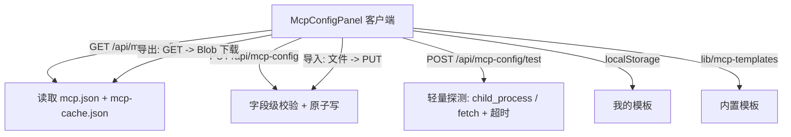

## 用户需求

优化 MCP 配置面板（`McpConfigPanel`），提升可用性、智能化与便捷性，并修复当前仅暴露 command/args/url、校验粗粒度、无连接测试、无模板/导入导出、无字段级错误定位的现状。

## 产品概述

将原本扁平的单表单升级为「分组清晰、可校验、可测试、可复用」的 MCP 服务配置中心：基础配置与高级配置分离，支持实时可达性探测、内置/个人模板一键套用、整份配置导入导出，错误精准到字段。

## 核心功能

1. **表单交互优化**：transport（stdio/url）切换；name/command/args/url/env/headers/lifecycle/超时等字段实时校验；command 提供常用二进制智能补全（datalist）；command 默认 `npx`、lifecycle 默认 `lazy` 等默认值填充。
2. **配置模板与导入导出**：内置常用预设（filesystem/github/fetch 等）与个人模板（localStorage 保存「当前配置」）；一键套用；整份 mcp.json 一键导出下载与文件导入。
3. **布局与分组**：基础配置（名称、传输方式、命令/URL）与高级配置（环境变量、请求头、生命周期、超时）折叠分组，结构清晰。
4. **实时连接状态测试**：新增后端轻量探测接口，stdio 校验命令可解析并能在超时内启动，url 做 HTTP/SSE 连通探测；前端每个服务与新增表单均提供「测试连接」按钮与可达/不可达反馈。
5. **错误提示精准化**：后端返回字段级错误（定位到具体服务与字段），前端内联红字提示；顶部错误横幅保留；界面响应式且交互流畅。

## 技术栈

- 沿用现有栈：Next.js 16 App Router、React 19 客户端组件、TypeScript（`strict`）、CSS 变量主题（明暗）+ 内联样式（与 `McpConfigPanel.tsx` 现有风格一致，不引入组件库）。
- 服务端：新增 `app/api/mcp-config/test/route.ts`，使用 Node `child_process`（stdio 探测，带超时）与 `fetch`（url 探测，带 AbortController 超时），不引入任何新依赖。
- 持久化：「我的模板」复用项目既有 localStorage 约定（参考 `usePersistentState` 风格），不增加后端存储。
- 校验：扩展 `lib/config-validators.ts`，新增字段级校验函数，复用既有 `ApiError`/`errorResponse` 返回形态。

## 实现方案

### 总体策略

保持「读/写分离 + 内联样式 + 零组件库」的既有约定，把单表单拆分为「列表 + 新增/编辑抽屉/卡片 + 模板/导入导出工具条」。连接测试走独立只读探测接口，避免影响 mcp.json 持久化与已有 adapter 安装流程。

### 关键技术决策

- **字段级校验**：在 `validateMcpServers` 之外新增 `validateMcpServersDetailed(servers): McpFieldError[]`，逐条返回 `{server?, field, message}`。PUT 路由改用它，返回 400 + `{errors:[...]}`，前端按字段内联渲染。保留旧函数或内部复用，向后兼容。
- **轻量探测（已与用户确认）**：`/api/mcp-config/test` 仅做可达性检查，不实现 MCP 握手——stdio 用 `execFile` 探测命令存在性与启动退出（带 ~8s 超时，捕获 ENOENT/超时），url 用 `fetch` + `AbortController` 探测连通（接受 2xx/3xx 或连接建立）。无副作用、不写盘。
- **模板**：`lib/mcp-templates.ts` 导出内置 `McpTemplate[]`（含 filesystem/github/fetch 等常用配置）；个人模板存 `localStorage["pi-web-mcp-templates"]`。套用即把模板字段灌入表单 state。
- **导入导出**：导出=前端 fetch `/api/mcp-config` 取 servers，构造 JSON Blob 触发下载；导入=`<input type=file>` 读取 JSON → 前端逐条校验 → PUT 覆盖写入（复用既有校验与 atomic 写）。不新增路由。
- **默认值与智能补全**：command 默认 `npx`；transport=url 时 name 可来自 URL host；command 提供 `npx/node/uvx/python3/python/docker/bun/deno` 的 `<datalist>` 补全；args 以空格分词，带实时预览。

### 性能与可靠性

- 探测接口服务端带硬超时（stdio `execFile` 的 `timeout` + `killSignal`；url `AbortController`），避免挂起；前端按钮 loading 态 + 失败兜底。
- 列表渲染沿用现有 `map` + `cardStyle`，新增/编辑复用同一份表单组件，避免重复状态。
- 校验为纯前端同步 + 提交时服务端复核，无额外重渲染开销。

## 实现要点（防回归）

- 复用 `csrfHeaders` / `validateCsrf`：探测接口为 POST，按既有约定做 CSRF 校验；PUT 已有校验保持不变。
- 复用 `config-file` 的 `readJsonFile/writeJsonFileAtomic`，勿直接 `fs.writeFile`；导入覆盖时保留 `imports` 字段（沿用现有合并逻辑）。
- 探测接口禁止在客户端/UI bundle 引入 `child_process`——仅限 `app/api/**`（符合 `serverExternalPackages` 约定）。
- 保留现有 adapter 状态药丸（标题同行）与 `mcpDisabled` 禁用逻辑，迁移时一并保留。
- 日志：探测失败仅返回精简 `detail`，不 dump 子进程 stderr 全文；遵循现有 `errorResponse` 形态。

## 架构设计



组件内部拆分为：`ServerList`（卡片/可展开编辑）、`ServerForm`（基础/高级分组 + 实时校验 + 测试）、`TemplateBar`（套用/保存/导入/导出）、`StatusBanner`（adapter 药丸与错误）。

## 目录结构

```
/data/Code/pi-web/
├── app/api/mcp-config/
│   ├── route.ts            # [MODIFY] PUT 改用字段级校验，返回 {errors:[]}；GET 不变
│   └── test/route.ts       # [NEW] POST 轻量可达性探测；CSRF 校验；返回 {reachable,detail,latencyMs?}
├── lib/
│   ├── config-validators.ts# [MODIFY] 新增 validateMcpServersDetailed(): McpFieldError[]（字段级精准报错）
│   └── mcp-templates.ts     # [NEW] 内置模板列表 McpTemplate[]（filesystem/github/fetch 等）
├── components/
│   └── McpConfigPanel.tsx   # [MODIFY] 重写为分组表单 + 模板/导入导出 + 连接测试 + 字段级错误；保留 adapter 药丸
└── lib/i18n/
    ├── zh.ts                # [MODIFY] 新增 mcp 表单/校验/测试/模板/导入导出 文案
    └── en.ts                # [MODIFY] 同步英文文案
```

## 关键代码结构

```ts
// lib/config-validators.ts
export interface McpFieldError {
  server?: string;                 // 出错的服务名（新增/编辑时为 "__new__"）
  field: "name" | "command" | "url" | "args" | "env" | "headers"
       | "lifecycle" | "idleTimeout" | "requestTimeoutMs" | "root";
  message: string;                 // 已本地化的可读信息键或模板
}
export function validateMcpServersDetailed(servers: unknown): McpFieldError[];

// app/api/mcp-config/test/route.ts
interface McpProbeRequest { transport: "stdio" | "url"; command?: string; args?: string[]; url?: string; }
interface McpProbeResult { reachable: boolean; detail: string; latencyMs?: number; }

// lib/mcp-templates.ts
interface McpTemplate {
  id: string; label: string; builtin: boolean;
  server: McpServerEntry;          // 复用 mcp-config route 的 McpServerEntry 形态
}
```

## 设计风格

沿用现有 IDE 控制台风格（紧凑、功能优先、明暗自适应），不使用外部组件库，保持内联样式 + CSS 变量（`--bg/--text/--border/--accent/--text-dim`）。整体以「卡片列表 + 可展开编辑表单 + 顶部工具条」布局，圆角 8px、1px 描边、细腻间距，与当前 `cardStyle/btnStyle/inputStyle` 视觉一致，确保与项目其它配置面板协调。

## 页面分区（自上而下）

1. **顶部工具条**：标题「MCP 服务」+ adapter 状态药丸（已启动/检测中/未安装，同行右对齐刷新按钮）；下方一排工具按钮：模板、存为模板、导入、导出。
2. **错误/状态横幅**：adapter 未安装警告 + 安装按钮；字段级服务端错误汇总（可折叠）。
3. **服务列表**：每个服务一张卡片，显示名称、传输徽标、命令/URL、生命周期/工具/资源计数；卡片可点击展开为「编辑态」（复用同一表单组件），含「测试连接」「移除」按钮。
4. **新增表单（可折叠）**：基础分组（名称、传输切换、命令/URL、参数）+ 「测试连接」按钮；高级分组（折叠）：环境变量键值对、请求头、生命周期下拉、idle/request 超时；底部「添加/取消」。
5. **模板面板（弹层/下拉）**：内置预设 + 我的模板列表，点击即套用字段；「存为模板」将当前表单存入 localStorage。

## 交互细节

- transport 切换用分段控件（stdio | url），即时切换可见字段。
- 实时校验：输入即校验，字段下方红字内联提示；不阻塞输入，仅阻止提交。
- 连接测试：按钮 loading 转圈，返回后变为绿色「可达」/ 红色「不可达 + 原因」小药丸，与 adapter 药丸风格统一。
- 高级分组默认折叠，点击展开，减少视觉负担。
- 响应式：容器内 `overflowY:auto`，输入控件 `width:100%`、`min-width:0`，窄屏下按钮与表单自动换行；保持暗/亮主题一致。

## Agent Extensions

### SubAgent

- **code-explorer**
- Purpose: 实现前核对既有配置面板（如 ModelsConfig/PluginsConfig）的表单、校验、CSRF、导入导出与测试写法，确认约定一致，避免引入不一致模式。
- Expected outcome: 输出关键文件与可复用片段清单，确保本次改动贴合项目既有风格与边界（如 CSRF、atomic 写、localStorage 持久化）。